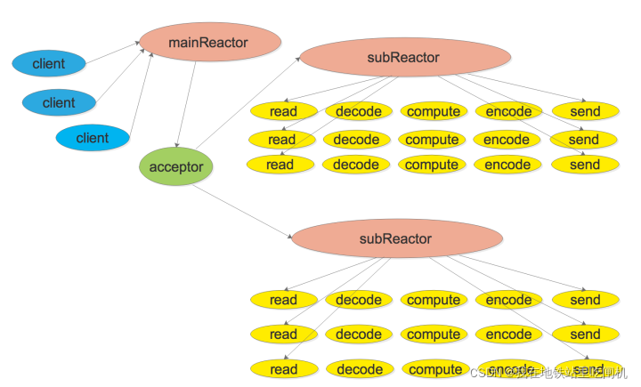

# C++11 网络库

+ 类设计UML图

+ Reactor模式

## 开发环境

* linux kernel version 5.4.0 (ubuntu 20.04 Server)
* gcc version 9.4.0
* cmake version 3.16.1

进入src目录下，项目编译执行`./build.sh`即可，头文件生成至目录`/usr/include/`，`.so`库文件生成至目录`/usr/lib/`。

## 功能介绍

1. `EventLoop`、`Channel`、`Poller`、`EPollPoller`等设计是为实现Reactor模式的核心事件循环`EventLoop`负责轮询执行`Poller`。遵守Reactor模式的回调与非阻塞编程思想，要进行读、写、错误、关闭等事件时需执行的回调函数，均绑定至`Channel`中，只需从中调用即可，事件发生后进行相应的`handle`处理即可
2. `Thread`、`EventLoopThread`、`EventLoopThreadPool`等将线程和`EventLoop`事件轮询绑定在一起，实现真正意义上的`one loop per thread`，`EventLoopThreadPool`为IO线程集中管控的类，用于向`Acceptor`接收的Tcp连接提供不同的`EventLoop`
3. `TcpServer`、`TcpConnection`、`Acceptor`、`Socket`等是`main-loop`对网络连接的响应并轮询分发至各个`sub-loop`的实现，其中注册大量回调函数
4. `Buffer`为网络库自行设计的自动扩容的缓冲区，保证数据有序性到达

## 技术亮点

1. `EventLoop`中使用了`eventfd`来调用`wakeup()`，高效的唤醒阻塞在`epoll_wait`上的`EventLoop`
2. 在`EventLoop`中注册回调`cb`至`pendingFunctors_`，并在`doPendingFunctors`中通过`swap()`的方式，快速换出注册的回调，只在`swap()`时加锁，减少代码临界区长度，提升效率。（若不通过`swap()`的方式去处理，而是加锁执行`pendingFunctors`中的回调，然后解锁，会出现什么问题呢？1. 临界区过大，锁降低了服务器响应效率 2. 若执行的回调中执行`queueInLoop`需要抢占锁时，会发生死锁）
3. `Logger`可以设置日志等级，调试代码时可以开启`DEBUG`打印日志；若启动服务器，由于日志会影响服务器性能，可适当关闭`DEBUG`相关日志输出
4. 在`Thread`中通过`C++lambda`表达式以及信号量机制保证线程创建时的有序性，只有当线程获取到了其自己的`tid`后，才算启动线程完毕
5. `TcpConnection`继承自`enable_shared_from_this`，`TcpConnection`对象可以调用`shared_from_this()`方法给其内部回调函数，相当于创建了一个带引用计数的`shared_ptr`，可参考链接 [link](https://blog.csdn.net/gc348342215/article/details/123215888)
6. 采用`Reactor`模型和多线程结合的方式，实现了高并发非阻塞网络库

## 设计解析
1. [网络库全流程及类分析](./md/class.md)
2. [互斥锁封装方法](./md/mutex.md)
3. [线程池设计](./md/threadPool.md)

## 扩展计划
1. 后续会陆续补足网络库的健壮性
2. 增加网络库基础设施，例如 HTTP Server
3. 增加现代网络应用设计的基础组件，如 TimeQueue
4. 优化学习算法，对一段时间内的网络通信情况进行统计，动态调整
5. 考虑优化sub-loop负载均衡算法

## 测试
+ 例如编写一个 EchoServer，展示网络库运行情况

## 致谢
+ 陈硕 (chenshuo.com)
+ s1mpleZzz (space.bilibili.com/118909182)

持续更新..
